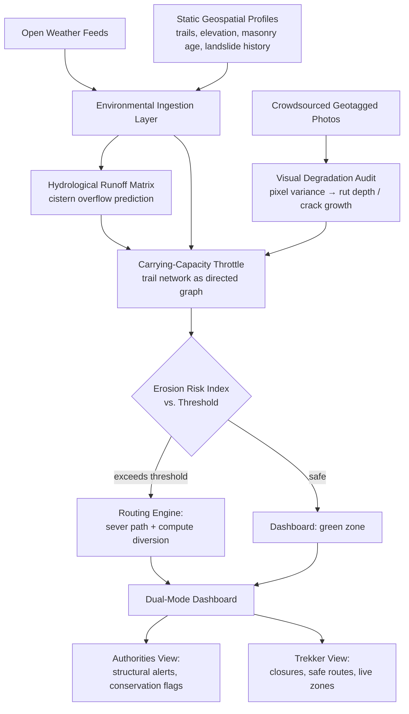

# FortFlux 🏔️
### A Micro-Climate Resilience Platform for the Sahyadri Forts

> **Track:** Biodiversity, Ecosystem Conservation & Climate Awareness
> **Hackathon:** PCCOE IGC

---

## 1. The Problem

The forts of the Sahyadri range — Rajgad, Torna, Raigad, Sinhagad, and dozens more — are living heritage sites, not museum pieces. Every monsoon, their trails, cisterns, and centuries-old masonry take a beating from rainfall they were never engineered for at today's foot-traffic scale. Two forces compound the damage:

- **Environmental stress**: intense, erratic monsoon surges accelerate soil rutting, undercut trail steps, and overload rock-cut cisterns designed for a slower, gentler climate.
- **Human load**: trekking has exploded in popularity, and the same narrow paths that once saw a handful of pilgrims now carry weekend crowds — with no real-time way to know when a trail has crossed from "busy" to "unsafe."

Today, conservation decisions on these trails are reactive — a landslide happens, a mortar joint fails, *then* someone responds. There's no system that fuses live weather, terrain history, structural condition, and crowd density into a single early-warning picture.

## 2. The Solution

**FortFlux** is an end-to-end platform that turns each fort's trail network into a living, risk-aware digital twin — predicting erosion, mudslips, and structural degradation *before* they happen, and rerouting people away from danger in real time.

It combines four things nobody currently connects:
1. Live weather data
2. Static geospatial + historical landslide profiles
3. Crowdsourced visual evidence of physical decay
4. Real-time crowd density

...and fuses them into a single Erosion Risk Index that drives live trail routing decisions.

## 3. How It Works

### 🌧️ Environmental Ingestion Layer
Continuously pulls localized open meteorological data — precipitation rate, humidity swings, wind gusts — and cross-references it against static geospatial profiles: trail segment geometry, elevation gradients, masonry age, and historical landslide records for that specific fort.

### 📸 Crowdsourced Visual Degradation Audit
Trekkers submit geotagged photos of trail sections and structural features as they walk. The system runs pixel-variance analysis along marked mortar joints to estimate soil rut depth and crack expansion over time — turning every trekker into a passive structural sensor.

### 💧 Hydrological Runoff Matrix
Models surface water velocity during monsoon surges and calculates volumetric influx for the fort's ancient rock-cut cisterns, flagging impending overflow events that could scour the masonry steps below them.

### 🕸️ Algorithmic Carrying-Capacity Throttle
The entire trail network is modeled as a **dynamic directed graph**. Every path segment's risk weight is recalculated in real time as:

```
Risk Weight = Baseline Traversal Difficulty
              × Soil Saturation
              × Slope Steepness
              × (Live Visitor Density ÷ Max Safe Footfall)
```

### 🎚️ Live Simulation Interface
A demo-ready control panel lets users stress-test the model with sliders for rainfall intensity and trekker volume, watching the Erosion Risk Index climb in real time as conditions worsen.

### 🚦 Adaptive Routing Engine
When a segment's risk score crosses a critical threshold, the engine automatically:
- Severs the compromised path
- Computes a safe alternative diversion route
- Pushes the update to a **dual-mode dashboard** — one view for park authorities (structural alerts, conservation flags), one for visiting crowds (color-coded vulnerability zones, live closures)

## 4. System Architecture



## 5. Suggested Tech Stack

| Layer | Suggested Tools |
|---|---|
| Weather ingestion | Open-Meteo / IMD open API |
| Geospatial data | GeoJSON trail profiles + QGIS for authoring |
| Graph engine | Python (NetworkX) for the directed trail graph + risk recalculation |
| Visual audit | OpenCV pixel-variance analysis on uploaded images |
| Backend | FastAPI / Node.js, WebSocket for live dashboard pushes |
| Frontend dashboard | React + Leaflet/Mapbox for the geographic layer |
| Simulation UI | React sliders driving the same risk-weight formula live |

*(Swap freely — this is a suggested stack, not a constraint. Optimize for what your team can ship fastest in the hackathon window.)*

## 6. Why This Fits the Track

- **Biodiversity & ecosystem conservation**: protects the surrounding slope ecology from erosion-driven habitat loss triggered by over-trafficked, storm-damaged trails.
- **Climate awareness**: makes monsoon-driven risk visible and actionable in real time, rather than abstract.
- **Heritage angle**: directly protects centuries-old masonry and water infrastructure that standard "trail safety" apps ignore entirely.

## 7. Demo Flow (Judging Round)

1. Open the dashboard on a chosen fort (e.g., Rajgad) — show baseline green trail network.
2. Drag the rainfall-intensity slider up — watch soil saturation rise on affected segments.
3. Drag the trekker-volume slider up simultaneously — show compounding risk on a narrow bottleneck segment.
4. Cross the threshold — watch the routing engine sever the path live and draw the diversion.
5. Switch to the authority view — show the structural alert flagging a cistern nearing overflow.

## 8. Future Scope

- Integrate satellite-derived soil moisture data to reduce reliance on point weather stations.
- Add a predictive (not just reactive) 24–48hr risk forecast using historical monsoon patterns.
- Partner with ASI / state archaeology departments for verified masonry-age and repair-history data.
- Expand the visual audit model with a trained CNN for automated crack-growth classification instead of pixel-variance heuristics.

---
*Built for the PCCOE IGC Hackathon — Biodiversity, Ecosystem Conservation & Climate Awareness track.*
