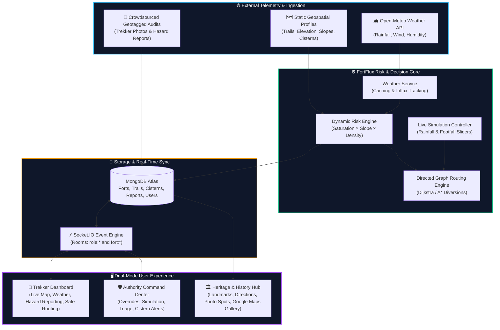

<div align="center">

# ⛰️ FortFlux

### Micro-Climate Resilience & Dynamic Trail Safety Platform for Sahyadri Heritage Forts

[](/)
[](/)
[](/)
[](/)

**Predict trail erosion. Prevent mudslips. Reroute trekkers in real time. Preserve living heritage.**

FortFlux is an end-to-end intelligent platform that predicts trail erosion, soil saturation, and structural degradation across 18 iconic mountain forts of the Western Ghats (Sahyadris). By fusing live open meteorological telemetry, digital elevation data, carrying-capacity algorithms, and crowdsourced hazard audits, FortFlux severs compromised paths and computes safe diversions in real time.

---

</div>

## 📋 Table of Contents

- [The Crisis in the Sahyadris](#-the-crisis-in-the-sahyadris)
- [The FortFlux Solution](#-the-fortflux-solution)
- [Core Capabilities & Features](#-core-capabilities--features)
- [18 Sahyadri Heritage Forts](#-18-sahyadri-heritage-forts)
- [System Architecture](#-system-architecture)
- [Risk Scoring & Adaptive Routing Engine](#-risk-scoring--adaptive-routing-engine)
- [Real-Time Telemetry & WebSockets](#-real-time-telemetry--websockets)
- [Tech Stack](#-tech-stack)
- [Project Directory Structure](#-project-directory-structure)
- [Getting Started](#-getting-started)
- [Environment Configuration](#-environment-configuration)
- [Complete API Reference](#-complete-api-reference)
- [Interactive Demo Flow (Judging Round)](#-interactive-demo-flow-judging-round)
- [Why This Fits the Track](#-why-this-fits-the-track)
- [Future Roadmap](#-future-roadmap)
- [Team](#-team)

---

## 🔴 The Crisis in the Sahyadris

The historic forts of the Sahyadri range — **Rajgad, Torna, Raigad, Sinhagad, Harishchandragad, Shivneri**, and more — are living ecological and cultural monuments. Every monsoon season, their cliffside trails, centuries-old rock-cut water cisterns (*tankis*), and mortar joints face catastrophic forces:

1. **Monsoon Volatility & Hydrological Scouring**: Extreme, erratic cloudbursts saturate volcanic basalt soil, eroding earthen trails, triggering rockfalls, and causing uncontrolled overflow from rock-cut cisterns that scours ancient masonry stairways.
2. **Exponential Footfall & Unregulated Density**: Trekking tourism has grown exponentially. Narrow ridgelines engineered for medieval garrisons now carry thousands of weekend visitors without any real-time capacity management or early warnings.
3. **Reactive Conservation Blindspot**: Trail closures and rescue operations currently happen *after* a fatal slip or rock collapse occurs. Authorities lack real-time digital twins that correlate live rainfall, soil saturation, slope gradients, and crowd density.

---

## 💡 The FortFlux Solution

**FortFlux** bridges the gap between conservation engineering and trekker safety by creating a **real-time, risk-aware digital twin** of the Sahyadri fort network.

```
Live Weather Feeds (Precipitation + Wind + Humidity)
                   +
Digital Elevation Model (Slope Gradient + Soil Type)
                   +
Real-Time Crowd Density (Live Visitors / Safe Capacity)
                   +
Crowdsourced Visual Audits (Photos + Hazard Reports)
                   ▼
  [ DYNAMIC EROSION RISK INDEX ]
                   ▼
   [ AUTOMATED GRAPH REROUTING ]
```

When environmental or footfall risk crosses safety thresholds on any trail, the system **automatically severs the route in the directed graph**, computes alternative safe pathways, and instantly broadcasts updates across all connected trekker apps and authority command centers via WebSockets.

---

## ✨ Core Capabilities & Features

### 🌧️ Real-Time Meteorological Ingestion Layer
- Integrates directly with high-resolution **Open-Meteo APIs** for pinpoint geographical coordinates of each mountain fort.
- Monitors hourly rainfall volume, soil moisture impact, relative humidity, and wind gusts with intelligent in-memory caching to avoid rate limits.

### 🕸️ Directed Graph Carrying-Capacity & Routing Engine
- Models the trail network of each fort as a **weighted directed graph**.
- Edge weights update dynamically based on live risk.
- Implements Dijkstra / A* pathfinding to calculate optimal safe routes from base village trailheads to upper citadels (*Balekilla*).
- When a path is compromised (Risk ≥ 75 or status = `closed`), the engine severs the edge and computes a live detour.

### 🎚️ Live Authority Stress-Testing Simulation
- Equips park rangers and disaster management teams with interactive **Simulation Sliders** for:
  - **Rainfall Intensity (0 – 150 mm/hr)**
  - **Trekker Density Multiplier (0.5x – 3.0x)**
- Allows authorities to stress-test trail networks under projected cloudburst conditions and pre-emptively divert traffic.

### 📸 Crowdsourced Visual Hazard Audit & Triage
- Trekkers upload geotagged photos of trail damage, loose scree, waterlogging, or structural cracks directly from their phones.
- Uploads are processed with image compression and classified by hazard severity (`low`, `moderate`, `high`, `critical`).
- Authorities review and verify reports on an interactive map, updating trail statuses in one click.

### 🏛️ Comprehensive Heritage & Landmark Explorer (18 Forts)
- **Key Landmarks to Visit**: High-resolution authentic photographic cards with architectural descriptions.
- **⭐ Must-See Landmarks**: Curated list of iconic historical spots with estimated visit times.
- **📸 Best Photo Spots**: Scenic vantage points for sunrise, sunset, and panoramic valley photography.
- **Turn-by-Turn Directions**: Step-by-step navigation from trailhead to summit with distances and duration.
- **🚗 Route Information**: Motorable road accessibility, base village access, public transit/shared jeeps, and parking availability with rates.
- **Community Photo Gallery**: Interactive Google Maps style gallery with visitor-contributed photographs and full-screen view.
- **Chronological Timeline & Degradation Trends**: Historical milestone timeline and environmental wear charts (scale 1–10).

### 🗺️ Dual-Mode Dashboard Architecture
- **Trekker Portal**: Clean, high-contrast map with color-coded risk paths (`Open` / `Caution` / `Closed` / `Diverted`), live weather widget, crowd congestion badges, and turn-by-turn routing.
- **Authority Command Center**: Comprehensive monitoring suite with trail management, manual overrides, simulation sliders, cistern overflow indicators, and report triage verification.

---

## 🏰 18 Sahyadri Heritage Forts

FortFlux provides comprehensive geospatial models, trails, cisterns, historical milestones, and route directions across 18 major forts:

| Fort | District | Elevation | Unique Heritage Feature |
|---|---|---|---|
| **Sinhagad Fort** | Pune | 1,312 m | Battle of Sinhagad (1670), Tanaji Malusare Memorial, Pune & Kalyan Darwaja |
| **Rajgad Fort** | Pune | 1,376 m | 26-year capital of Swarajya, Suvela Machi Nedhe, Balekilla citadel |
| **Torna Fort** | Pune | 1,403 m | First fort captured by Shivaji Maharaj (1646), Zunjar & Budhla Machi |
| **Purandar Fort** | Pune | 1,387 m | Birthplace of Sambhaji Maharaj, defense by Murarbaji Deshpande |
| **Lohagad Fort** | Pune | 1,033 m | Historic treasury fort, 1.5 km Vinchukata (Scorpion's Tail) ridge |
| **Visapur Fort** | Pune | 1,084 m | Peshwa palace ruins, natural gushing monsoon waterfall rock staircase |
| **Tikona Fort** | Pune | 1,066 m | Pyramidal watchtower, steep rock-cut steps, panoramic Pawna lake views |
| **Raigad Fort** | Raigad | 820 m | Coronation capital of Shivaji Maharaj (1674), Takmak Tok, Jagdishwar temple |
| **Pratapgad Fort** | Satara | 1,080 m | Site of the epic 1659 duel with Afzal Khan, Bhavani Mata temple |
| **Ajinkyatara Fort** | Satara | 1,006 m | "The Impregnable Star", capital during Queen Tara Rani & Shahu Maharaj |
| **Panhala Fort** | Kolhapur | 845 m | Largest Deccan fort, Teen Darwaza, Sajja Kothi, escape to Vishalgad |
| **Shivneri Fort** | Pune | 1,067 m | Sacred birthplace of Chhatrapati Shivaji Maharaj (1630), 7 defense gates |
| **Harishchandragad** | Ahmednagar | 1,424 m | 6th-century fort, 2000ft concave Konkan Kada cliff, Kedareshwar cave |
| **Rajmachi Fort** | Pune | 825 m | Twin citadels (Shrivardhan & Manaranjan), Borghat pass, Fireflies festival |
| **Sindhudurg Fort** | Sindhudurg | Sea Level | Kurte Island sea fortress (1664), concealed sea gate, freshwater sea wells |
| **Vijaydurg Fort** | Sindhudurg | Sea Level | Naval HQ of Kanhoji Angre, triple concentric sea walls, 1868 Helium discovery |
| **Murud-Janjira** | Raigad | Sea Level | Undefeated marine citadel of the Siddis, 22 sea bastions, Kalal Bangadi cannon |
| **Korigad Fort** | Pune | 923 m | 2 km intact walkable perimeter wall, freshwater plateau lakes, Aamby Valley views |

---

## 🏗️ System Architecture



---

## Rate Limiting with Arcjet

<p align="center">
  
</p>

---


## 📐 Risk Scoring & Adaptive Routing Engine

### 1. Dynamic Erosion Risk Formula

Every trail segment's risk score ($0 - 100$) is calculated in real time:

$$\text{Risk Score} = \text{Baseline Difficulty} \times \left(1 + \frac{\text{Rainfall}}{150}\right) \times \text{Slope Gradient} \times \left(\frac{\text{Live Footfall}}{\text{Max Safe Footfall}}\right) \times 25$$

| Parameter | Source | Range | Description |
|---|---|---|---|
| **Baseline Difficulty** | Pre-surveyed trail data | $1.0 - 2.0$ | Terrain roughness, surface rock exposure |
| **Soil Saturation Factor** | Live Open-Meteo telemetry | $1.0 - 2.0$ | Normalized against $150\text{ mm/hr}$ cloudburst cap |
| **Slope Gradient** | Digital Elevation Model | $1.0 - 2.0$ | Steepness multiplier ($>30^\circ$ incline doubles risk) |
| **Footfall Ratio** | Live visitor counts | $0.1 - 2.5+$ | Active foot traffic vs safe carrying capacity |

### 2. Status Classification Thresholds

- 🟢 **Open (Score 0 – 39)**: Safe for general traversal. Minimal erosion danger.
- 🟡 **Caution (Score 40 – 74)**: Slippery surfaces, localized mudding, moderate footfall bottleneck. Caution advised.
- 🔴 **Closed (Score 75 – 100)**: Hazardous soil saturation, active landslide risk, or critical overcrowding. Route automatically severed.
- 🔵 **Diverted**: Segment flagged with an active alternate diversion path.

---

## ⚡ Real-Time Telemetry & WebSockets

FortFlux utilizes **Socket.IO** with authenticated cookie handshakes and granular room subscriptions:

```
Clients join rooms:
├── fort:{slug}    (e.g., fort:rajgad, fort:sinhagad)
└── role:{role}    (e.g., role:authority, role:trekker)
```

### Broadcasted Socket Events:
| Event | Trigger | Payload |
|---|---|---|
| `trail-status-changed` | Authority override or automated risk threshold trigger | `{ trailId, fortSlug, status, currentRiskScore, currentFootfall, updatedAt }` |
| `risk-update` | Live simulation slider adjustment or weather update | `{ fortSlug, simulatedRainfall, simulatedFootfall, trails: [...] }` |
| `report-created` | Trekker submits geotagged hazard photo | `{ reportId, fortSlug, trailId, hazardType, severity, photoUrl }` |
| `cistern-alert` | Projected runoff exceeds cistern capacity | `{ cisternId, fortSlug, waterLevel, overflowRisk }` |

---

## 🛠️ Tech Stack

### Frontend
- **Framework**: React 19, Vite 8, React Router v7
- **Styling**: Tailwind CSS v4, Glassmorphism, CSS Grid
- **State Management**: Zustand (modular stores for auth, forts, risk, routing, weather, reports)
- **Mapping & GIS**: MapLibre GL / Leaflet, custom SVG pins, polyline vector rendering
- **Icons**: Lucide React
- **HTTP & Sockets**: Axios (with credentials), Socket.IO Client

### Backend
- **Runtime & Server**: Node.js, Express.js v5 (HTTP + WebSocket server)
- **Database**: MongoDB Atlas / local MongoDB with Mongoose ODM (2dsphere geospatial indexing)
- **Authentication**: JWT stored in `httpOnly` secure cookies, bcrypt password hashing, Role-Based Access Control (RBAC)
- **File Uploads**: Multer with file type validation and size limits
- **Weather Integration**: Open-Meteo REST API with memory-based TTL caching
- **Real-Time Communication**: Socket.IO with cookie-based JWT handshake authentication

---

## 📁 Project Directory Structure

```
FortFlux/
├── .gitignore
├── analysis_results.md
├── backend/
│   ├── package-lock.json
│   ├── package.json
│   └── src/
│       ├── controllers/
│       │   ├── auth.controller.js
│       │   ├── fort.controller.js
│       │   ├── report.controller.js
│       │   ├── risk.controller.js
│       │   ├── routing.controller.js
│       │   ├── user.controller.js
│       │   └── weather.controller.js
│       ├── data/
│       │   └── seed.js
│       ├── lib/
│       │   ├── arcjet.js
│       │   ├── cloudinary.js
│       │   ├── db.js
│       │   ├── env.js
│       │   ├── firebase-admin.js
│       │   ├── jwt.js
│       │   └── socket.js
│       ├── middlewares/
│       │   ├── arcjet.middleware.js
│       │   ├── auth.middleware.js
│       │   └── upload.js
│       ├── models/
│       │   ├── Cistern.js
│       │   ├── Fort.js
│       │   ├── FortHistory.js
│       │   ├── Trail.js
│       │   ├── TrailReport.js
│       │   └── User.js
│       ├── routes/
│       │   ├── auth.route.js
│       │   ├── fort.route.js
│       │   ├── report.route.js
│       │   ├── risk.route.js
│       │   ├── routing.route.js
│       │   ├── user.route.js
│       │   └── weather.route.js
│       ├── scripts/
│       │   ├── cleanReports.js
│       │   └── seedHistory.js
│       ├── server.js
│       └── services/
│           ├── risk.service.js
│           ├── routing.service.js
│           └── weather.service.js
├── frontend/
│   ├── .gitignore
│   ├── eslint.config.js
│   ├── index.html
│   ├── package-lock.json
│   ├── package.json
│   ├── public/
│   │   ├── favicon.svg
│   │   └── forts/
│   │       ├── ajinkyatara.jpg
│   │       ├── harishchandragad.webp
│   │       ├── korigad.jpg
│   │       ├── lohagad.webp
│   │       ├── murud-janjira.jpg
│   │       ├── panhala.jpg
│   │       ├── pratapgad.jpg
│   │       ├── purandar.avif
│   │       ├── raigad.webp
│   │       ├── rajgad.jpg
│   │       ├── rajmachi.jpg
│   │       ├── shivneri.webp
│   │       ├── sindhudurg.jpg
│   │       ├── sinhagad.webp
│   │       ├── tikona.jpg
│   │       ├── torna.webp
│   │       ├── vijaydurg.webp
│   │       └── visapur.avif
│   ├── README.md
│   ├── src/
│   │   ├── App.jsx
│   │   ├── components/
│   │   │   ├── ErosionChart.jsx
│   │   │   ├── ErrorBoundary.jsx
│   │   │   ├── ImageComparisonSlider.jsx
│   │   │   ├── map/
│   │   │   │   ├── FortMap.jsx
│   │   │   │   ├── MapControls.jsx
│   │   │   │   ├── MapPopup.jsx
│   │   │   │   └── RiskLegend.jsx
│   │   │   ├── Navbar.jsx
│   │   │   ├── PhotoUploadModal.jsx
│   │   │   ├── ProtectedRoute.jsx
│   │   │   ├── RateLimitModal.jsx
│   │   │   ├── RoleRoute.jsx
│   │   │   ├── ScrollToTop.jsx
│   │   │   ├── Timeline.jsx
│   │   │   └── Toast.jsx
│   │   ├── config/
│   │   │   ├── firebase.js
│   │   │   └── mapConfig.js
│   │   ├── data/
│   │   │   └── fortHistoryData.js
│   │   ├── index.css
│   │   ├── lib/
│   │   │   ├── axios.js
│   │   │   └── socket.js
│   │   ├── main.jsx
│   │   ├── pages/
│   │   │   ├── AuthorityDashboard.jsx
│   │   │   ├── HistoryPage.jsx
│   │   │   ├── LoginPage.jsx
│   │   │   ├── ProfilePage.jsx
│   │   │   ├── SignupPage.jsx
│   │   │   └── TrekkerDashboard.jsx
│   │   ├── store/
│   │   │   ├── useAuthStore.js
│   │   │   ├── useFortStore.js
│   │   │   ├── useRateLimitStore.js
│   │   │   ├── useReportStore.js
│   │   │   ├── useRiskStore.js
│   │   │   ├── useRoutingStore.js
│   │   │   ├── useToastStore.js
│   │   │   └── useWeatherStore.js
│   │   └── utils/
│   │       └── geoJsonUtils.js
│   └── vite.config.js
├── package-lock.json
└── README.md

```

---

## 🚀 Getting Started

### Prerequisites

- **Node.js** v18+ (Node v20 or v22 recommended)
- **npm** v9+
- **MongoDB** (Local instance running at `mongodb://localhost:27017` or MongoDB Atlas URI)

### 1. Clone the Repository

```bash
git clone https://github.com/Ashutoshmore24/FortFlux.git
cd FortFlux
```

### 2. Backend Setup

```bash
cd backend
npm install

# Copy environment template and configure
cp .env.example .env
```

Edit `backend/.env` with your values (see [Environment Configuration](#-environment-configuration)).

#### Seed Database (Forts, Trails, Cisterns & History)

```bash
# Seed all 18 forts, trail networks, and cisterns
node src/data/seed.js

# Seed historical timelines and erosion trends
node src/scripts/seedHistory.js
```

### 3. Frontend Setup

```bash
cd ../frontend
npm install
```

### 4. Run Locally

Open two terminal windows:

**Terminal 1 — Backend Server:**
```bash
cd backend
npm run dev
# Server running on http://localhost:6000
```

**Terminal 2 — Frontend Dev Server:**
```bash
cd frontend
npm run dev
# Vite dev server running on http://localhost:5173
```

Navigate to `http://localhost:5173` in your browser.

---

## 🔐 Environment Configuration

Create a `backend/.env` file with the following variables:

```env
NODE_ENV=development
PORT=6000
MONGODB_URI=mongodb://localhost:27017/fortflux
JWT_SECRET=your_super_secret_jwt_key_min_32_characters
JWT_EXPIRES_IN=4d
CLIENT_URL=http://localhost:5173
```

---

## 📡 Complete API Reference

### Authentication — `/api/auth`
| Method | Endpoint | Access | Description |
|---|---|---|---|
| `POST` | `/api/auth/signup` | Public | Register new user (`trekker` or `authority`) |
| `POST` | `/api/auth/login` | Public | Sign in and set secure `jwt` cookie |
| `POST` | `/api/auth/logout` | Public | Clear authentication cookie |
| `GET` | `/api/auth/check` | 🔒 Authenticated | Verify active session & retrieve user object |
| `PUT` | `/api/auth/profile` | 🔒 Authenticated | Update username, organization, or preferences |
| `GET` | `/api/auth/authority-check` | 🔒🛡️ Authority/Admin | Verify elevated authority credentials |

### Forts, Trails & Cisterns — `/api/forts`
| Method | Endpoint | Access | Description |
|---|---|---|---|
| `GET` | `/api/forts` | Public | Retrieve overview list of all 18 forts |
| `GET` | `/api/forts/:slug` | Public | Fetch comprehensive fort detail (fort, trails, cisterns) |
| `GET` | `/api/forts/:slug/history` | Public | Fetch timeline, degradation trends, and architecture |
| `GET` | `/api/forts/:slug/trails` | Public | Get all trail segments with risk scores for a fort |
| `GET` | `/api/forts/:slug/cisterns` | Public | Get all rock-cut water cisterns and overflow states |
| `PUT` | `/api/forts/trails/:trailId` | 🔒🛡️ Authority/Admin | Manually override trail status (`open`, `caution`, `closed`, `diverted`) |

### Risk Engine & Simulation — `/api/risk`
| Method | Endpoint | Access | Description |
|---|---|---|---|
| `GET` | `/api/risk/:fortSlug` | 🔒 Authenticated | Compute real-time risk scores for all trails of a fort |
| `POST` | `/api/risk/:fortSlug/apply` | 🔒🛡️ Authority/Admin | Persist simulated/computed risk scores and broadcast via sockets |

### Routing & Auto-Diversions — `/api/routing`
| Method | Endpoint | Access | Description |
|---|---|---|---|
| `GET` | `/api/routing/:slug` | Public | Compute optimal safe path from trailhead to summit |
| `POST` | `/api/routing/simulate` | Public | Calculate live diversion route given rainfall/footfall/severed paths |

### Hazard Reporting & Triage — `/api/reports`
| Method | Endpoint | Access | Description |
|---|---|---|---|
| `GET` | `/api/reports/recent` | Public | Fetch recent verified crowdsourced reports |
| `GET` | `/api/reports/fort/:slug` | Public | Fetch all hazard reports for a specific fort |
| `POST` | `/api/reports` | 🔒 Authenticated | Submit geotagged hazard report with photo |
| `PATCH` | `/api/reports/:id/status` | 🔒🛡️ Authority/Admin | Triage report status (`verified`, `resolved`, `dismissed`) |

### Weather Telemetry — `/api/weather`
| Method | Endpoint | Access | Description |
|---|---|---|---|
| `GET` | `/api/weather/:fortSlug` | 🔒 Authenticated | Retrieve live Open-Meteo weather telemetry |
| `POST` | `/api/weather/cache/clear` | 🔒🛡️ Admin | Flush cached weather observations |

---

## 👥 Team

| Member | Focus Area |
|---|---|
| **Ashutosh More** | Full-Stack Architecture, Real-Time Systems, GIS Integration |
| **Utkarsh Patkotwar** | Backend Engine, Routing Algorithms, Data Modeling |
| **Mohit Sojal** | Frontend UI/UX, Dynamic Visualizations, State Management |
| **Prachi Gorle** | Environmental Research, Geospatial Data, Conservation Metrics |
| **Rahul Gadekar** | Telemetry APIs, Testing & Quality Assurance |

---

<div align="center">

**Built with pride for the PCCOE IGC Hackathon**  
*Biodiversity, Ecosystem Conservation & Climate Awareness Track*

⛰️ *Preserving the historic Sahyadri mountain legacy through proactive climate engineering.*

</div>
