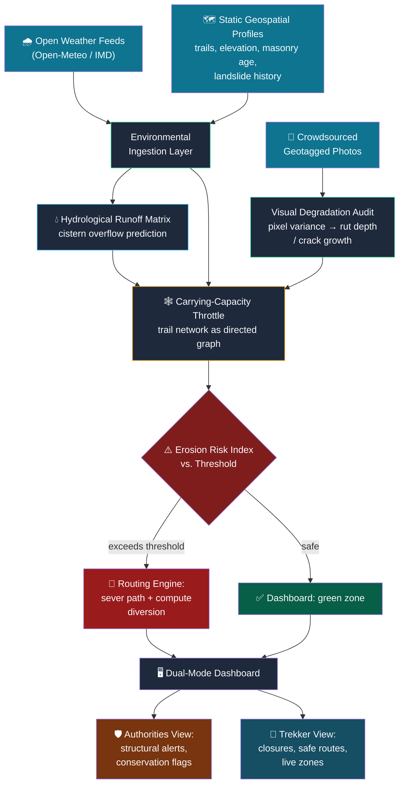

<div align="center">

# ⛰️ FortFlux

### Micro-Climate Resilience Platform for Sahyadri Heritage Forts

[](/)
[](/)
[](/)

**Predict trail erosion. Prevent mudslips. Protect centuries-old heritage.**

FortFlux is an end-to-end platform that predicts trail erosion, mudslips, and structural degradation at historical Sahyadri mountain forts — rerouting trekkers away from danger in real time.

---

</div>

## 📋 Table of Contents

- [The Problem](#-the-problem)
- [The Solution](#-the-solution)
- [Key Features](#-key-features)
- [System Architecture](#-system-architecture)
- [Risk Weight Formula](#-risk-weight-formula)
- [Tech Stack](#-tech-stack)
- [Project Structure](#-project-structure)
- [Getting Started](#-getting-started)
- [Environment Variables](#-environment-variables)
- [API Reference](#-api-reference)
- [Demo Flow](#-demo-flow-judging-round)
- [Why This Fits the Track](#-why-this-fits-the-track)
- [Future Scope](#-future-scope)
- [Team](#-team)

---

## 🔴 The Problem

The forts of the Sahyadri range — **Rajgad, Torna, Raigad, Sinhagad**, and dozens more — are living heritage sites, not museum pieces. Every monsoon, their trails, cisterns, and centuries-old masonry take a beating from rainfall they were never engineered for at today's foot-traffic scale.

Two forces compound the damage:

- **Environmental Stress** — Intense, erratic monsoon surges accelerate soil rutting, undercut trail steps, and overload rock-cut cisterns designed for a slower, gentler climate.
- **Human Overload** — Trekking has exploded in popularity. The same narrow paths that once saw a handful of pilgrims now carry weekend crowds — with no real-time way to know when a trail has crossed from "busy" to "unsafe."

> Today, conservation decisions on these trails are **reactive** — a landslide happens, a mortar joint fails, *then* someone responds. There's no system that fuses live weather, terrain history, structural condition, and crowd density into a single early-warning picture.

---

## 💡 The Solution

**FortFlux** turns each fort's trail network into a **living, risk-aware digital twin** — predicting erosion, mudslips, and structural degradation *before* they happen, and rerouting people away from danger in real time.

It fuses four data streams that nobody currently connects:

| # | Data Stream | Source |
|---|---|---|
| 1 | **Live weather data** | Open meteorological feeds (precipitation, humidity, wind) |
| 2 | **Geospatial + historical profiles** | Trail geometry, elevation gradients, masonry age, landslide records |
| 3 | **Crowdsourced visual evidence** | Geotagged trekker photos analyzed for structural decay |
| 4 | **Real-time crowd density** | Live visitor count per trail segment |

...and processes them into a single **Erosion Risk Index** that drives live trail routing decisions.

---

## ✨ Key Features

### 🌧️ Environmental Ingestion Layer
Continuously pulls localized open meteorological data — precipitation rate, humidity swings, wind gusts — and cross-references it against static geospatial profiles: trail segment geometry, elevation gradients, masonry age, and historical landslide records for each fort.

### 📸 Crowdsourced Visual Degradation Audit
Trekkers submit geotagged photos of trail sections and structural features as they walk. The system runs pixel-variance analysis along marked mortar joints to estimate **soil rut depth** and **crack expansion** over time — turning every trekker into a passive structural sensor.

### 💧 Hydrological Runoff Matrix
Models surface water velocity during monsoon surges and calculates volumetric influx for the fort's ancient rock-cut cisterns, flagging impending **overflow events** that could scour the masonry steps below them.

### 🕸️ Algorithmic Carrying-Capacity Throttle
The entire trail network is modeled as a **dynamic directed graph**. Every path segment's risk weight is recalculated in real time by multiplying baseline traversal difficulty against live environmental variables.

### 🎚️ Live Simulation Interface
A demo-ready control panel lets users stress-test the model with **dynamic sliders** for rainfall intensity and trekker volume, watching the Erosion Risk Index climb in real time as conditions worsen.

### 🚦 Adaptive Routing Engine
When a segment's risk score crosses a critical threshold, the engine automatically:
- **Severs** the compromised path
- **Computes** a safe alternative diversion route
- **Pushes** the update to a **dual-mode geographic dashboard**

### 🗺️ Dual-Mode Dashboard
| View | Audience | Shows |
|---|---|---|
| **Trekker View** | Visiting crowds | Color-coded vulnerability zones, live closures, safe routes |
| **Authority View** | Park authorities & rangers | Structural alerts, conservation flags, cistern overflow data, carrying-capacity controls |

---

## 🏗️ System Architecture



---

## 📐 Risk Weight Formula

The core of FortFlux's decision engine. Every trail segment's risk is recalculated in real time:

```
Risk Weight = Baseline Traversal Difficulty
              × Soil Saturation (rainfall / max_rainfall)
              × Slope Steepness
              × (Live Visitor Density ÷ Max Safe Footfall)
```

| Parameter | Source | Range |
|---|---|---|
| Baseline Traversal Difficulty | Pre-surveyed trail profile | 1.0 – 2.0 |
| Soil Saturation | Live rainfall ÷ 150 mm/hr max | 0.0 – 1.0 |
| Slope Steepness | Elevation gradient data | 1.0 – 2.0 |
| Visitor Density / Max Safe | Live count ÷ capacity threshold | 0.1 – 2.0+ |

> **Critical Threshold:** When `Risk Weight ≥ 75%`, the routing engine automatically severs the segment and computes a diversion.

---

## 🛠️ Tech Stack

| Layer | Technology |
|---|---|
| **Frontend** | React 19, Vite 8, Tailwind CSS v4, Zustand |
| **UI Components** | Lucide React icons |
| **Map & Geo** | Leaflet / Mapbox GL JS |
| **Backend** | Node.js, Express v5 |
| **Database** | MongoDB Atlas (Mongoose ODM) |
| **Authentication** | JWT (httpOnly cookies) + bcrypt |
| **Real-time** | WebSocket / Server-Sent Events |
| **Weather Data** | Open-Meteo API |
| **Routing** | React Router v7 |
| **HTTP Client** | Axios |

---

## 📁 Project Structure

```
FortFlux/
├── backend/
│   ├── src/
│   │   ├── controllers/
│   │   │   └── auth.controller.js      # Signup, login, logout, profile
│   │   ├── middlewares/
│   │   │   └── auth.middleware.js       # JWT verification + RBAC
│   │   ├── models/
│   │   │   └── User.js                 # User schema (trekker/authority/admin)
│   │   ├── routes/
│   │   │   └── auth.route.js           # /api/auth/* endpoints
│   │   ├── lib/
│   │   │   ├── db.js                   # MongoDB connection
│   │   │   ├── env.js                  # Environment config
│   │   │   └── jwt.js                  # Token generation + cookie options
│   │   └── server.js                   # Express entry point
│   ├── .env.example                    # Environment template
│   └── package.json
│
├── frontend/
│   ├── public/
│   │   └── favicon.svg                 # FortFlux mountain icon
│   ├── src/
│   │   ├── components/
│   │   │   ├── Navbar.jsx              # Brand bar + role-aware navigation
│   │   │   ├── ProtectedRoute.jsx      # Auth guard wrapper
│   │   │   └── RoleRoute.jsx           # RBAC route wrapper
│   │   ├── pages/
│   │   │   ├── LoginPage.jsx           # Sign-in form
│   │   │   ├── SignupPage.jsx          # Role selection + registration
│   │   │   ├── TrekkerDashboard.jsx    # Trekker field portal
│   │   │   └── AuthorityDashboard.jsx  # Authority command center
│   │   ├── store/
│   │   │   └── useAuthStore.js         # Zustand auth state
│   │   ├── lib/
│   │   │   └── axios.js                # Axios instance config
│   │   ├── App.jsx                     # Root router + auth check
│   │   ├── main.jsx                    # React entry
│   │   └── index.css                   # Tailwind + base styles
│   ├── index.html
│   ├── vite.config.js
│   └── package.json
│
├── .gitignore
└── README.md
```

---

## 🚀 Getting Started

### Prerequisites

- **Node.js** v18+ (recommended v22)
- **npm** v9+
- **MongoDB Atlas** account (or local MongoDB instance)

### 1. Clone the repository

```bash
git clone https://github.com/Ashutoshmore24/FortFlux.git
cd FortFlux
```

### 2. Backend Setup

```bash
cd backend
npm install

# Create your environment file
cp .env.example .env
# Edit .env with your MongoDB URI and JWT secret
```

### 3. Frontend Setup

```bash
cd frontend
npm install
```

### 4. Run the Development Servers

**Terminal 1 — Backend:**
```bash
cd backend
npm run dev
# → Server running on http://localhost:6000
```

**Terminal 2 — Frontend:**
```bash
cd frontend
npm run dev
# → App running on http://localhost:5173
```

> The Vite dev server automatically proxies `/api` requests to the backend on port 6000.

---

## 🔐 Environment Variables

Create a `backend/.env` file using `backend/.env.example` as template:

| Variable | Description | Example |
|---|---|---|
| `NODE_ENV` | Runtime environment | `development` |
| `PORT` | Backend server port | `6000` |
| `MONGODB_URI` | MongoDB connection string | `mongodb+srv://...` |
| `JWT_SECRET` | Secret key for signing JWTs | `your_secret_key_here` |
| `JWT_EXPIRES_IN` | Token expiration duration | `4d` |

---

## 📡 API Reference

### Authentication — `/api/auth`

| Method | Endpoint | Auth | Description |
|---|---|---|---|
| `POST` | `/api/auth/signup` | ❌ | Register a new user (trekker or authority) |
| `POST` | `/api/auth/login` | ❌ | Sign in with email + password |
| `POST` | `/api/auth/logout` | ❌ | Clear auth cookie |
| `GET` | `/api/auth/check` | 🔒 | Verify current session / get user data |
| `PUT` | `/api/auth/profile` | 🔒 | Update username, organization, or profile pic |
| `GET` | `/api/auth/authority-check` | 🔒🛡️ | Authority/admin role verification |

**User Roles:**

| Role | Access Level |
|---|---|
| `trekker` | Trekker Dashboard — trail status, erosion index, photo uploads |
| `authority` | Authority Command Center — simulation controls, trail closures, cistern alerts |
| `admin` | Full access to all features |

---

## 🎬 Demo Flow (Judging Round)


1. **Open** the dashboard on a chosen fort (e.g., Rajgad) — show the baseline green trail network on the map.
2. **Drag** the rainfall-intensity slider up — watch soil saturation rise on affected segments.
3. **Drag** the trekker-volume slider up simultaneously — show compounding risk on a narrow bottleneck segment.
4. **Watch** the threshold cross — the routing engine severs the path live and draws the diversion route.
5. **Switch** to the Authority View — show the structural alert flagging a cistern nearing overflow.

---

## 🌿 Why This Fits the Track

| Track Criteria | How FortFlux Addresses It |
|---|---|
| **Biodiversity & Ecosystem Conservation** | Protects surrounding slope ecology from erosion-driven habitat loss triggered by over-trafficked, storm-damaged trails |
| **Climate Awareness** | Makes monsoon-driven risk visible and actionable in real time, rather than abstract |
| **Heritage Conservation** | Directly protects centuries-old masonry and water infrastructure that standard "trail safety" apps ignore entirely |

---

## 🔮 Future Scope

- 🛰️ **Satellite soil moisture** — Integrate satellite-derived data to reduce reliance on point weather stations.
- 📊 **48-hour risk forecast** — Predictive (not just reactive) erosion alerts using historical monsoon patterns.
- 🏛️ **ASI partnership** — Verified masonry-age and repair-history data from the Archaeological Survey of India.
- 🧠 **CNN crack detection** — Replace pixel-variance heuristics with a trained convolutional neural network for automated crack-growth classification.
- 📱 **Mobile app** — Native trekker companion with offline trail maps and push notifications.

---

## 👥 Team

| Member | Role |
|---|---|
| **Ashutosh More** | - |
| **Utkarsh Patkotwar** | - |
| **Mohit Sojal** | - |
| **Prachi Gorle** | - |
| **Rahul Gadekar** | - |

---

<div align="center">

**Built for the PCCOE IGC Hackathon**
*Biodiversity, Ecosystem Conservation & Climate Awareness Track*

⛰️ *Protecting the Sahyadri, one trail at a time.*

</div>
