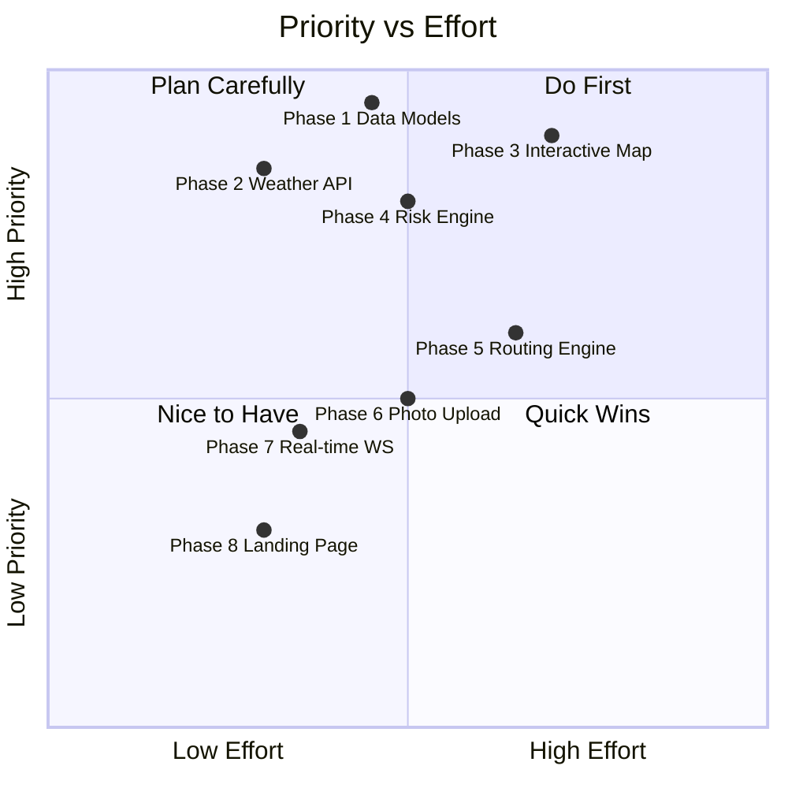

# ⛰️ FortFlux — Complete Codebase Analysis & Phase-Wise Roadmap

## Current State Summary

I've analyzed all **22 source files** across the project. Here's what's built vs. what's missing.

### ✅ What's Done (Foundation Layer)

| Area | Status | Files |
|---|---|---|
| **Backend Auth** | ✅ Complete | [server.js](file:///c:/Users/LENOVO%20LOQ/Desktop/FortFlux-1/backend/src/server.js), [auth.controller.js](file:///c:/Users/LENOVO%20LOQ/Desktop/FortFlux-1/backend/src/controllers/auth.controller.js), [auth.middleware.js](file:///c:/Users/LENOVO%20LOQ/Desktop/FortFlux-1/backend/src/middlewares/auth.middleware.js), [auth.route.js](file:///c:/Users/LENOVO%20LOQ/Desktop/FortFlux-1/backend/src/routes/auth.route.js) |
| **User Model** | ✅ Complete | [User.js](file:///c:/Users/LENOVO%20LOQ/Desktop/FortFlux-1/backend/src/models/User.js) — roles: `trekker`, `authority`, `admin` |
| **JWT + Cookies** | ✅ Complete | [jwt.js](file:///c:/Users/LENOVO%20LOQ/Desktop/FortFlux-1/backend/src/lib/jwt.js) — httpOnly, sameSite strict, 4-day expiry |
| **DB + Env Config** | ✅ Complete | [db.js](file:///c:/Users/LENOVO%20LOQ/Desktop/FortFlux-1/backend/src/lib/db.js), [env.js](file:///c:/Users/LENOVO%20LOQ/Desktop/FortFlux-1/backend/src/lib/env.js) |
| **Frontend Auth Flow** | ✅ Complete | [useAuthStore.js](file:///c:/Users/LENOVO%20LOQ/Desktop/FortFlux-1/frontend/src/store/useAuthStore.js), [LoginPage.jsx](file:///c:/Users/LENOVO%20LOQ/Desktop/FortFlux-1/frontend/src/pages/LoginPage.jsx), [SignupPage.jsx](file:///c:/Users/LENOVO%20LOQ/Desktop/FortFlux-1/frontend/src/pages/SignupPage.jsx) |
| **RBAC Routing** | ✅ Complete | [ProtectedRoute.jsx](file:///c:/Users/LENOVO%20LOQ/Desktop/FortFlux-1/frontend/src/components/ProtectedRoute.jsx), [RoleRoute.jsx](file:///c:/Users/LENOVO%20LOQ/Desktop/FortFlux-1/frontend/src/components/RoleRoute.jsx), [App.jsx](file:///c:/Users/LENOVO%20LOQ/Desktop/FortFlux-1/frontend/src/App.jsx) |
| **Dashboard Shells** | ⚠️ Static Only | [TrekkerDashboard.jsx](file:///c:/Users/LENOVO%20LOQ/Desktop/FortFlux-1/frontend/src/pages/TrekkerDashboard.jsx), [AuthorityDashboard.jsx](file:///c:/Users/LENOVO%20LOQ/Desktop/FortFlux-1/frontend/src/pages/AuthorityDashboard.jsx) |
| **Navbar** | ✅ Complete | [Navbar.jsx](file:///c:/Users/LENOVO%20LOQ/Desktop/FortFlux-1/frontend/src/components/Navbar.jsx) — role-aware navigation |

### 🔴 What's Missing (Core Features from README)

| Feature | Described in README | Currently Exists |
|---|---|---|
| **Interactive Map** (Leaflet/Mapbox) | ✅ | ❌ No map at all |
| **Live Weather API Integration** (Open-Meteo) | ✅ | ❌ Hardcoded "Moderate Monsoon Surge" |
| **Trail Network as Directed Graph** | ✅ | ❌ No trail/fort data models |
| **Dynamic Risk Calculation** (live, from API data) | ✅ | ⚠️ Only client-side formula in AuthorityDashboard with sliders |
| **Adaptive Routing Engine** (auto-sever + diversion) | ✅ | ❌ Only a manual button toggle |
| **Crowdsourced Photo Upload** | ✅ | ❌ Button exists but does nothing |
| **Hydrological Runoff / Cistern Overflow** | ✅ | ❌ Static alert text only |
| **Fort/Trail Data Models** (backend) | ✅ | ❌ Only `User` model exists |
| **Real-time Updates** (WebSocket/SSE) | ✅ | ❌ No real-time infrastructure |
| **Landing/Home Page** | Implied | ❌ Redirects straight to login |

---

## 🗺️ Phase-Wise Roadmap: What To Do Next

---

### Phase 1: Data Models & Fort Seed Data 🏗️
**Priority: HIGHEST — Everything depends on this**

> [!IMPORTANT]
> Without Fort/Trail data models, the map, risk engine, and dashboards have nothing to render.

#### Backend Work
- **[NEW]** `backend/src/models/Fort.js` — Fort schema (name, coordinates, elevation, trails, cisterns, historical info)
- **[NEW]** `backend/src/models/Trail.js` — Trail segment schema (start/end coords, slope, baselineDifficulty, maxSafeFootfall, status, riskScore)
- **[NEW]** `backend/src/models/Cistern.js` — Cistern schema (location, capacity, currentLevel, overflowThreshold)
- **[NEW]** `backend/src/data/seed.js` — Seed script with real Rajgad/Torna/Sinhagad trail data (coordinates, segments, cisterns)
- **[NEW]** `backend/src/controllers/fort.controller.js` — CRUD endpoints for fort & trail data
- **[NEW]** `backend/src/routes/fort.route.js` — `/api/forts`, `/api/forts/:id/trails`

#### Estimated effort: 3–4 hours

---

### Phase 2: Live Weather Integration 🌧️
**Priority: HIGH — Feeds into the Risk Engine**

#### Backend Work
- **[NEW]** `backend/src/services/weather.service.js` — Open-Meteo API integration
  - Fetch precipitation, humidity, wind speed for fort coordinates
  - Cache results (avoid API rate limits)
  - Endpoint: `GET /api/weather/:fortId`

#### Frontend Work
- **[MODIFY]** [TrekkerDashboard.jsx](file:///c:/Users/LENOVO%20LOQ/Desktop/FortFlux-1/frontend/src/pages/TrekkerDashboard.jsx) — Replace hardcoded "Moderate Monsoon Surge" with live API data
- **[NEW]** `frontend/src/store/useWeatherStore.js` — Zustand store for weather state

#### Estimated effort: 2–3 hours

---

### Phase 3: Interactive Map with Trail Overlay 🗺️
**Priority: HIGH — The visual centerpiece of the demo**

#### Frontend Work
- Install `leaflet` + `react-leaflet` (or Mapbox GL JS)
- **[NEW]** `frontend/src/components/map/FortMap.jsx` — Main map component
  - Fort markers with popups
  - Trail segments as colored polylines (green/amber/red based on risk)
  - Cistern markers with capacity indicators
- **[NEW]** `frontend/src/components/map/TrailPolyline.jsx` — Risk-colored trail rendering
- **[NEW]** `frontend/src/components/map/RiskLegend.jsx` — Color legend overlay
- **[MODIFY]** [TrekkerDashboard.jsx](file:///c:/Users/LENOVO%20LOQ/Desktop/FortFlux-1/frontend/src/pages/TrekkerDashboard.jsx) — Embed `FortMap` as the hero element
- **[MODIFY]** [AuthorityDashboard.jsx](file:///c:/Users/LENOVO%20LOQ/Desktop/FortFlux-1/frontend/src/pages/AuthorityDashboard.jsx) — Embed `FortMap` with authority-specific controls

#### Estimated effort: 4–5 hours

---

### Phase 4: Real-Time Risk Engine ⚡
**Priority: HIGH — The brain of the system**

#### Backend Work
- **[NEW]** `backend/src/services/risk.service.js` — Server-side risk weight calculation
  ```
  Risk = BaselineDifficulty × (rainfall / 150) × slopeGradient × (footfall / maxSafe)
  ```
- **[NEW]** `backend/src/controllers/risk.controller.js` — `GET /api/risk/:fortId` returns per-segment risk scores
- **[MODIFY]** [AuthorityDashboard.jsx](file:///c:/Users/LENOVO%20LOQ/Desktop/FortFlux-1/frontend/src/pages/AuthorityDashboard.jsx) — Wire sliders to API instead of client-only formula
- **[NEW]** `frontend/src/store/useRiskStore.js` — Zustand store for risk state + polling

#### Estimated effort: 3–4 hours

---

### Phase 5: Adaptive Routing Engine 🚦
**Priority: MEDIUM — Killer demo feature**

#### Backend Work
- **[NEW]** `backend/src/services/routing.service.js` — Graph traversal engine
  - Model trail network as directed graph (adjacency list)
  - When risk ≥ 75%, sever edge and compute Dijkstra/BFS diversion
  - Return severed segments + alternative route
- **[NEW]** `backend/src/controllers/routing.controller.js` — `POST /api/routing/simulate`

#### Frontend Work
- **[MODIFY]** Map components — Animate trail severing (red dashed line) and diversion (green pulsing path)
- **[MODIFY]** [AuthorityDashboard.jsx](file:///c:/Users/LENOVO%20LOQ/Desktop/FortFlux-1/frontend/src/pages/AuthorityDashboard.jsx) — "Sever Path" button triggers API, map updates live

#### Estimated effort: 4–5 hours

---

### Phase 6: Crowdsourced Photo Upload 📸
**Priority: MEDIUM — Differentiating feature**

#### Backend Work
- **[NEW]** `backend/src/models/TrailReport.js` — Report schema (photo URL, location, trailSegmentId, userId, timestamp, analysis results)
- **[NEW]** `backend/src/controllers/report.controller.js` — Upload endpoint with image storage (Cloudinary or S3)
- **[NEW]** `backend/src/routes/report.route.js` — `POST /api/reports`, `GET /api/reports/:trailId`

#### Frontend Work
- **[NEW]** `frontend/src/components/PhotoUpload.jsx` — Camera/file picker with geolocation tagging
- **[MODIFY]** [TrekkerDashboard.jsx](file:///c:/Users/LENOVO%20LOQ/Desktop/FortFlux-1/frontend/src/pages/TrekkerDashboard.jsx) — Wire the "Submit Trail Photo Evidence" button

#### Estimated effort: 3–4 hours

---

### Phase 7: Real-Time Updates (WebSocket/SSE) 📡
**Priority: MEDIUM — Polish for live demo**

#### Backend Work
- Install `socket.io`
- **[MODIFY]** [server.js](file:///c:/Users/LENOVO%20LOQ/Desktop/FortFlux-1/backend/src/server.js) — Attach Socket.IO server
- Emit events: `risk-update`, `trail-severed`, `trail-reopened`, `cistern-alert`

#### Frontend Work
- **[NEW]** `frontend/src/lib/socket.js` — Socket.IO client connection
- **[MODIFY]** Stores — Listen for real-time events, update UI reactively

#### Estimated effort: 2–3 hours

---

### Phase 8: Landing Page & Polish ✨
**Priority: LOW — Final presentation layer**

#### Frontend Work
- **[NEW]** `frontend/src/pages/LandingPage.jsx` — Hero section, feature showcase, call-to-action
- **[MODIFY]** [App.jsx](file:///c:/Users/LENOVO%20LOQ/Desktop/FortFlux-1/frontend/src/App.jsx) — Add `/` route to LandingPage (unauthenticated)
- Improve slider styling in AuthorityDashboard (custom range thumbs)
- Add micro-animations and loading skeletons

#### Estimated effort: 2–3 hours

---

## 📊 Priority Matrix



## 🎯 Recommended Execution Order

| Order | Phase | Why This Order |
|---|---|---|
| **1st** | Phase 1: Data Models & Seed | Everything else depends on fort/trail data |
| **2nd** | Phase 2: Weather API | Needed for risk calculation |
| **3rd** | Phase 3: Interactive Map | Visual foundation for all dashboards |
| **4th** | Phase 4: Risk Engine | Brings the map alive with dynamic colors |
| **5th** | Phase 5: Routing Engine | The "wow" demo moment — auto-sever + diversion |
| **6th** | Phase 6: Photo Upload | Completes the trekker-side experience |
| **7th** | Phase 7: WebSocket/SSE | Makes authority actions push to trekkers live |
| **8th** | Phase 8: Landing + Polish | Final presentation layer |

> [!TIP]
> For a hackathon demo, **Phases 1–5 are essential**. Phases 6–8 are polish. If you're time-constrained, focus on getting the map + risk engine + routing working with the simulation sliders — that's your demo story.

---

## Open Questions

1. **Which map library?** Leaflet (free, open-source) vs Mapbox GL JS (more polished, needs API key)?
2. **Image storage for photo uploads** — Cloudinary (easy) vs AWS S3 vs local disk?
3. **Do you want a landing page** for unauthenticated visitors, or keep the current redirect-to-login flow?
4. **Which forts to seed first?** Rajgad seems to be the primary demo fort based on the README — should we focus seed data there?
